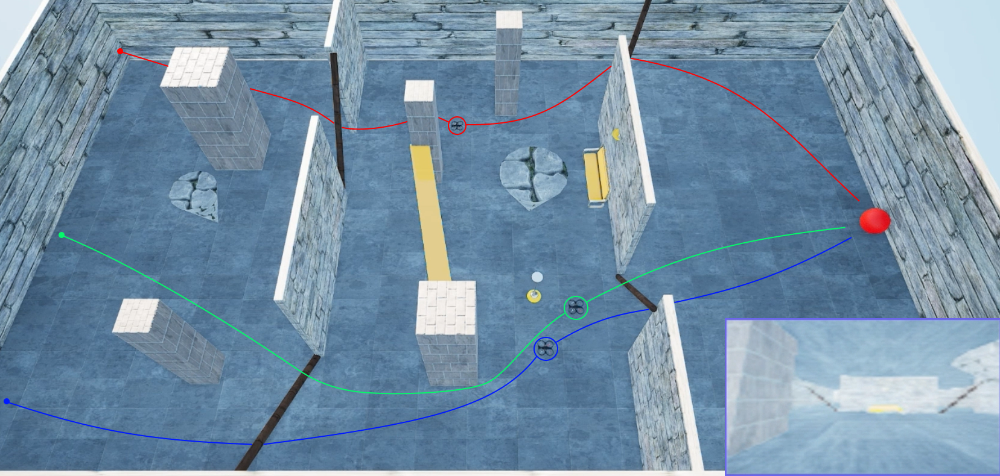

# Multi-agent Deep Reinforcement Learning for Drone Swarms using UE4, AirSim, Stable-Baselines3, PettingZoo, SuperSuit



## Overview

This repository contains the code and environments for my thesis on reinforcement learning of drone swarms using Unreal Engine 4 and Microsoft AirSim conducted at AIST, Tsukuba. It includes two separate implementations:

* **Single-Agent**: Training a single drone using PPO in a custom UE4 using StableBaseline3 and Gymnasium.
* **Multi-Agent**: Training a swarm of drones using PPO with modified versions of PettingZoo and Supersuit libraries to support multi-agent stacked observations in case of RGB camera.

All code is placed under the `airsim` folder and assumes AirSim and UE4 are installed following the [official AirSim documentation](https://microsoft.github.io/AirSim/).

## Repository Structure

```
.
├── README.md
├── imgs/                        # Images and gifs of the experiments
├── old_experiments/             # Old experiments for reference
├── single_agent/
│   ├── environment.yml          # Conda environment for single-agent setup
│   ├── settings/                # Single drone configuration for AirSim
│       └── ...
│   └── airsim/                  # Single-agent code to place inside AirSim PythonClient folder
│       └── ...
├── multi_agent/
│   ├── environment.yml          # Conda environment for multi-agent setup
│   ├── modified_libs/           # Modified packages (e.g., PettingZoo, SuperSuit)
│   ├── settings/                # Multi-drone configurations for AirSim
│       └── ...
│   └── airsim/                  # Multi-agent code to place inside AirSim PythonClient folder
│       └── ...
└── LICENSE
```

## Prerequisites
> ⚠️ **Warning:**  this client was developed and tested on **Windows only**. It may not install or run correctly on macOS or Linux.
> 
1. **Unreal Engine 4**: install via Epic Games Launcher. Ensure you have a UE4 project compatible with AirSim.
2. **Microsoft AirSim**: clone and build following the [AirSim installation guide](https://microsoft.github.io/AirSim/) *AirSim creates a `settings.json` file in your user Documents directory under `Documents/AirSim` on Windows or `~/Documents/AirSim` on Linux systems* ([microsoft.github.io](https://microsoft.github.io/AirSim/settings/)).
3. **Conda**: for managing Python environments.

## Single-Agent Setup

1. Navigate to the `single_agent` folder:

   ```bash
   cd single_agent
   ```
2. Create and activate the Conda environment:

   ```bash
   conda env create -f environment.yml     # Python 3.9.16 
   conda activate deeprl_single
   ```
3. Copy the `airsim` folder into your AirSim PythonClient directory:

   ```bash
   cp -r airsim /path/to/AirSim/PythonClient/
   ```
4. Launch UE4, open your project, and hit **Play** to run the environment (at this point, the drone will be stuck waiting for training/evaluation script).

## Multi-Agent Setup

1. Navigate to the `multi_agent` folder:

   ```bash
   cd multi_agent
   ```
2. Install the environment using:

   ```bash
   conda env create -f environment.yml     # Python 3.11.3 
   conda activate deeprl_multi
   ```
3. Copy the modified libs into your Python path, or install in editable mode:

   ```bash
   pip install -e modified_libs/pettingzoo
   pip install -e modified_libs/supersuit
   ... # Unfortunately, I can't remember which packages I modified.  I advice you to install all of them to avoid bugs.
   ```
4. **Place your custom `settings.json`** (with your desired number of drones) *into the folder created by AirSim at `Documents/AirSim` on Windows or `~/Documents/AirSim` on Linux*, replacing the default settings file ([microsoft.github.io](https://microsoft.github.io/AirSim/settings/)).
5. Copy the `airsim` folder into the AirSim Python Client folder:

   ```bash
   cp -r airsim /path/to/AirSim/PythonClient
   ```
6. Open UE4 and run your project; the multi-drone config in `settings.json` will enable different sized swarm spawn.

## Usage

> **Important**: All coordinates, spawn positions, and environment parameters in the code must be adapted to your specific UE4 map. If you decide to create your own map, you must update any hard-coded positions and settings to match the map you create. If you want to use my maps, every drone will start from a random initial position along the same axis and will be trained to reach a point lying within a specified radius of the target asset.
>
* Launch training via:

  ```bash
  python airsim/train.py    # Single and multi-agent
  ```

* Adjust hyperparameters or environment settings directly in the Python scripts or `settings.json`.

## Monitoring Training

You can monitor training progress, rewards, and hyperparameters using **TensorBoard**.

After launching training, open a terminal and run:

```bash
tensorboard --logdir path/to/tb_logs/
```

This allows you to inspect:

* Rewards over time
* Episode lengths
* Custom metrics
* Learning rates and other hyperparameters

## Evaluate

You can evaluate the trajectory of the single and multi-agent training by running:

  ```bash
  python airsim/evaluate.py    # Single and multi-agent
  ```

It will evaluate the weights saved inside `saved_policy`.

Always be sure to be running the UE4 env before running training or evaluation, and that the settings are set correctly (and renamed to `settings.json`). If you want to modify the number of drones, you should modify the code.


## Training Maps

> **Note:** The training maps used in this project are **~50 GB**.  
> They’re available on request; just let me know if you’d like a copy!
> They include:
> * A standard map populated with random assets.
> * A map featuring NPCs that move randomly.
> * A dense-forest map.
> * A composite map combining all the characteristics above.

## Acknowledgments

* Unreal Engine 4 (Epic Games)
* Microsoft AirSim
* PettingZoo & SuperSuit
* Prof. Akiya Kamimura & Prof. Andrea Roli

## Citation

If you find this work useful in your research, you are welcome to cite it. An official publication is currently in preparation and will be linked here once available. In the meantime, feel free to reference this repository and acknowledge the work.

## License

This project is licensed under the MIT License. See [LICENSE](LICENSE) for details.
